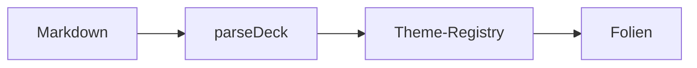

<!-- layout: title -->

# Slide Deck

## Kuro Signal Protocol

Präsentationen direkt aus dem Vault — Live-Theme-Switch, Fit-or-warn, PDF/PNG-Export.

---

<!-- layout: section -->

# Drei Stimmen, ein Akzent

---

## Die Lese-Ebene

Fließtext in **Inter**, Display in **EB Garamond**, Signale in **JetBrains Mono**. Der Akzent trägt Links wie [slide-deck](https://codeberg.org/jkaindl/slide-deck) und Listen-Marker.

- Token-basiert — ein Theme setzt nur `--sd-*`
- Die Struktur kommt vom Plugin
- `inline code` lebt in der Mono-Stimme

---

> Ein Theme malt die Kammer schwarz; ein Protokoll sagt dir, was die Dunkelheit bedeutet.

---

<!-- layout: two-column -->

## Notiz bleibt kanonisch

Die Folie ist eine **Projektion** der Markdown-Notiz — nicht umgekehrt.

- Frontmatter `theme:`
- Live-Switch im Preview
- Export: PDF + PNG

<!-- column -->

## Ein Artefakt

```ts
const deck = parseDeck(md);
const theme = registry.resolve(key);
render(deck, theme);
```

---

<!-- layout: two-column -->

## Callouts · die Signale

> [!note] Notiz
> Neutral, informativ.

> [!tip] Tipp
> Ein guter Hinweis.

> [!info] Info
> Zusätzlicher Kontext.

<!-- column -->

> [!warning] Warnung
> Hier ist Vorsicht geboten.

> [!danger] Gefahr
> Kritischer Zustand.

---

## Code & Mathematik

Syntax-Highlighting und KaTeX inline — $E = mc^2$ — sowie als Block:

$$\int_0^\infty e^{-x}\,dx = 1$$

```python
def render(deck, theme):
    return paint(deck, tokens[theme])
```

---

## Diagramme



---

<!-- layout: quote -->

> Die Folienansicht ist eine Projektion. Die Notiz bleibt die Wahrheit.

---

<!-- layout: section -->

# Jetzt live zu `shiro` wechseln

Im Preview das Theme-Dropdown auf **shiro** stellen — dieselben Folien, helles Reispapier.
