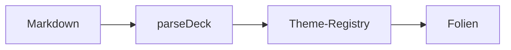

<!-- layout: cover-image -->

![[IMG_8291.png]]

# Das Testdeck

## Alle Folientypen · ein Durchlauf

---

<!-- layout: title -->

# Titelfolie

## Layout · Title

Eyebrow über dieser Zeile, Display-Titel, optischer Mittelpunkt leicht über der Mitte.

---

<!-- layout: section -->

# Abschnitts-Trenner

## Layout · Section

---

# Standard-Folie

Das `default`-Layout: Titel auf fester Baseline, Content läuft nach unten aus.

- Bullets an der linken Kante, Marker in Akzentfarbe
- Inline-Chips wie `parseDeck()` brechen nie intern
- Chip-Ketten: `prepare` $\rightarrow$ `research` $\rightarrow$ `summarize` binden am Pfeil
- Ein [Link](https://codeberg.org/jkaindl/slide-deck) in Gold, unterstrichen

---

# Tabellen

| Kategorie | Beschreibung | Status |
|---|---|---|
| Veranstaltungsmanagement | Mehrzeilige Zelle: Termin-Vor- und Nachbereitung mit strukturierter Übergabe an die nächste Zuständigkeit | ✅ erledigt |
| Wissensmanagement | Kurzer Text | 🔜 geplant |
| Kommunikation | Noch ein Beispiel mit etwas mehr Länge, damit die Zeile zuverlässig umbricht | ⏳ läuft |

Dieser Absatz gehört nicht mehr zur Tabelle — eigener Block, eigener Abstand.

---

<!-- layout: two-column -->

# Zwei Spalten

## Links

- Titel spannt beide Spalten
- Spaltenüberschriften als `##`
- Gemeinsame Baseline im Grid

<!-- column -->

## Rechts

- Verschachtelte Listen:
    - enger gebunden
    - als Hierarchie lesbar
- Gap aus der Spacing-Skala

---

<!-- layout: columns-3 -->

# Drei Spalten

## Eins

Kurzer Text pro Zelle.

<!-- column -->

## Zwei

Noch ein Absatz.

<!-- column -->

## Drei

Und der dritte.

---

<!-- layout: quote -->

> Ein Theme malt die Kammer schwarz; ein Protokoll sagt dir, was die Dunkelheit bedeutet.

*— Kuro Signal Protocol*

---

<!-- layout: stat -->

# 296

Tests halten dieses Design-System fest — die Zahl ist das `stat`-Layout.

---

<!-- layout: image-focus -->

# Bild im Fokus

![[IMG_8291.png]]

Caption zentriert, Media füllt die restliche Höhe.

---

# Callouts · die Signale

> [!info] Info
> Zusätzlicher Kontext, getönter Grund.

> [!warning] Warnung
> Hier ist Vorsicht geboten.

> [!tip] Tipp
> Panels atmen beidseitig mit einem Grundabstand.

---

<!-- layout: default code-heavy -->

# Code-Folie

Der `code-heavy`-Modifier hebt Blockcode auf volle Body-Größe:

```ts
export function deckCss(entry: ThemeEntry, customCss = ""): string {
  return assembleDeckCss([katexCss, entry.hljs, STRUCTURE_CSS,
    LAYOUTS_CSS, entry.themeCss, customCss]);
}
```

Mathe inline — $E = mc^2$ — und als Block:

$$\int_0^\infty e^{-x}\,dx = 1$$

---

<!-- layout: default compact -->

# Kompakt-Modifier

Der `compact`-Modifier verdichtet Skala und Rhythmus für listenlastige Folien:

- Kleinere Überschriften, engere Abstände
- Blockquote bleibt gestylt:

> Struktur kommt vom Plugin, Charakter vom Theme.

Eine Trennlinie als Motiv (als `<hr>`, denn `---` wäre ein Folien-Trenner):

<hr />

---

# Diagramm


